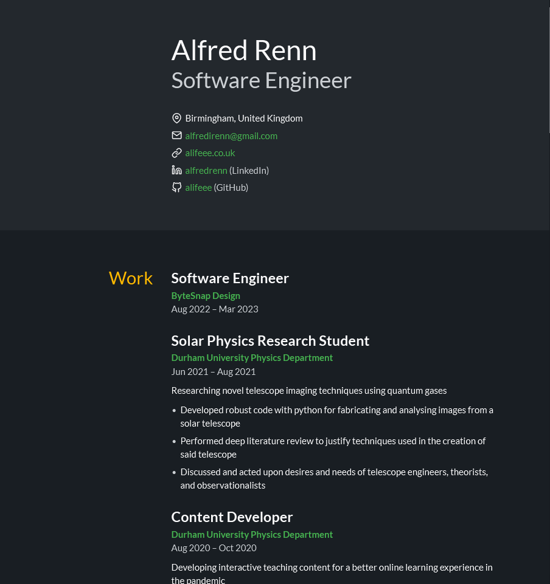

# JSON Resume

My CV in JSON format using <https://jsonresume.org/>

## Requirements

- Node.js
- npm

## Commands

### Install dependencies

```bash
npm install
```

### Validate JSON

```bash
npm run test
```

### Build HTML (with theme)

```bash
npm run build
# or
npm run build -- even
# or
npm run build -- paper
# ...
```

### Run with watch (with theme)

```bash
npm run dev
# or
npm run dev -- even
# ...
```

### View HTML

Open `resume.html` using the VSCode Live Server extension.


## Recommended themes

### [jsonresume-theme-even](https://github.com/rbardini/jsonresume-theme-even)


